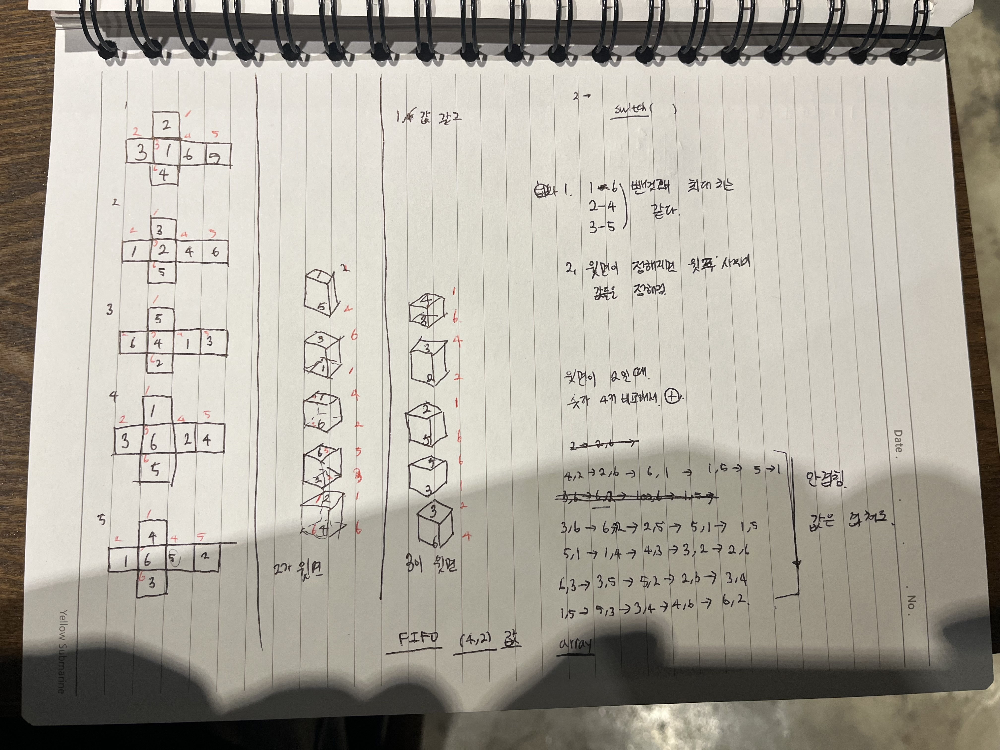

## 브루트포스

규칙은 찾았음 . 첫번째 윗면을 알고있으면 위에 쌓인 주사위들의 면이 결정되는데 코드로 풀지 못함

### gpt

작게 나누어 정복하라고 한다.

첫번째 주사위의 윗면은 다음 번 주사위의 아랫면의 값과 같음

1. 주사위에서 마주 보는 면을 찾는 함수를 먼저 만든다.
2. 한 개의 주사위에서 윗면과 아랫면을 제외한 네 개의 면 중 최댓값을 찾는 함수를 만든다.
3. 첫 번째 주사위의 윗면을 고정하고, 나머지 주사위의 윗면을 맞춰보는 코드를 만든다.
4. 위 과정을 6번 반복하여 최대값을 구한다.

머리가 돌이 된것 같구만.